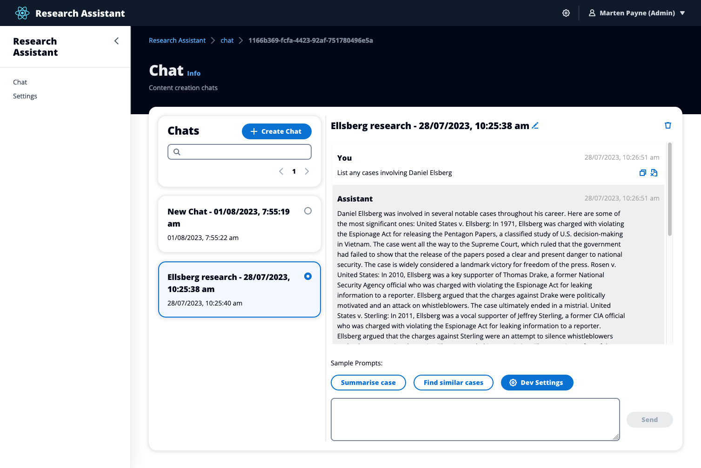

# GenAI Conversational RAG Reference

> Codename: "Galileo"

> All classes are under active development and subject to non-backward compatible changes or removal in any
> future version. These are not subject to the [Semantic Versioning](https://semver.org/) model.
> This means that while you may use them, you may need to update your source code when upgrading to a newer version of this package.

Conversational generative AI applications that provide search and summarisation against a collection of private documents (also known as "retrieval augmented generation" or RAG) are comprised of a number of complex components. These include: an elastic document ingestion pipeline, a special purpose vector store for document embeddings, a performant embeddings inference engine, API access to an aligned large language model, the combined functionality of which is exposed via a user interface that maintains session persistance and is secured with authN. Galileo was created to provide all of these things, integrated into a reference application. The use case of this reference application is a virtual legal research assistant, capable of answering questions against US Supreme Court decisions.

For full documentation, see <https://aws-samples.github.io/aws-genai-conversational-rag-reference>.

---

## Key Documentation Links

- **[Overview](https://aws-samples.github.io/aws-genai-conversational-rag-reference/overview/)**
- **[Mental Model](https://aws-samples.github.io/aws-genai-conversational-rag-reference/model/)**
- **[How it Works](https://aws-samples.github.io/aws-genai-conversational-rag-reference/overview/how/)**
- **[Getting Started](https://aws-samples.github.io/aws-genai-conversational-rag-reference/quick-start/)**
- **[Security Considerations](https://aws-samples.github.io/aws-genai-conversational-rag-reference/security/)**
- **[Contributing](https://aws-samples.github.io/aws-genai-conversational-rag-reference/contributing/)**
- **[Developer Guide](https://aws-samples.github.io/aws-genai-conversational-rag-reference/development/)**

---

## Disclaimer: Use of Third-Party Models

By using this sample, you agree that you may be deploying third-party models (“Third-Party Model”) into your specified user account. AWS does not own and does not exercise any control over these Third-Party Models. You should perform your own independent assessment, and take measures to ensure that you comply with your own specific quality control practices and standards, and the local rules, laws, regulations, licenses and terms of use that apply to you, your content, and the Third-Party Models, and any outputs from the Third-Party Models. AWS does not make any representations or warranties regarding the Third-Party Models.

## Disclaimer: Use of Prompt Engineering Templates

Any prompt engineering template is provided to you as AWS Content under the AWS Customer Agreement, or the relevant written agreement between you and AWS (whichever applies). You should not use this prompt engineering template in your production accounts, or on production, or other critical data. You are responsible for testing, securing, and optimizing the prompt engineering as appropriate for production grade use based on your specific quality control practices and standards. AWS may reuse this prompt engineering template in future engagements, but we will not share your confidential data nor your intellectual property with other customers.

## Security Considerations

> The sample code; software libraries; command line tools; proofs of concept; templates; or other related technology (including any of the foregoing that are provided by our personnel) is provided to you as AWS Content under the AWS Customer Agreement, or the relevant written agreement between you and AWS (whichever applies). You should not use this AWS Content in your production accounts, or on production or other critical data. You are responsible for testing, securing, and optimizing the AWS Content, such as sample code, as appropriate for production grade use based on your specific quality control practices and standards. Deploying AWS Content may incur AWS charges for creating or using AWS chargeable resources, such as running Amazon EC2 instances or using Amazon S3 storage.

There are a number of security considerations that should be taken into account prior to deploying and utilising this sample. The [security section](https://aws-samples.github.io/aws-genai-conversational-rag-reference/overview/security/) of the provided documentation outlines each of these.

## Other Useful Samples

If you looking to benchmark multiple LLMs and RAG engines in a simple way, you should checkout [aws-samples/aws-genai-llm-chatbot](https://github.com/aws-samples/aws-genai-llm-chatbot). That project focuses more on experimentation with models and vector stores, while this project focuses more on building an extendable 3-tier application.
