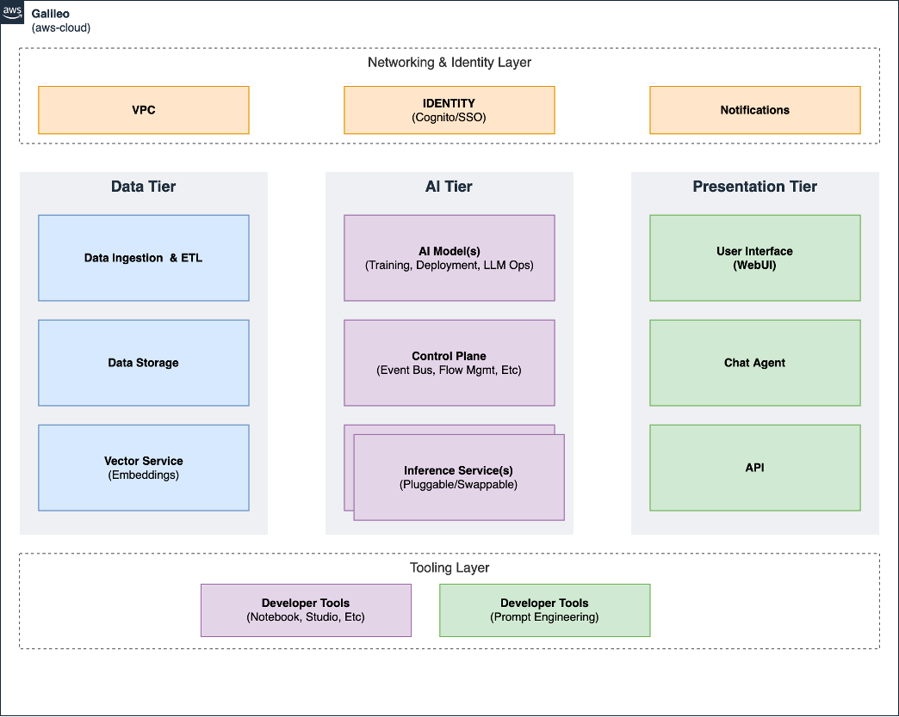

# GenAI Conversational RAG Reference (`ALPHA`)
> Codename: **Galileo**

Conversational generative AI applications that provide search and summarisation against a collection of private documents (also known as "retrieval augmented generation" or RAG) are comprised of a number of complex components. These include: an elastic document ingestion pipeline, a special purpose vector store for document embeddings, a performant embeddings inference engine, API access to an aligned large language model, the combined functionality of which is exposed via a user interface that maintains session persistance and is secured with authN. Galileo was created to provide all of these things, integrated into a reference application. The use case of this reference application is a virtual legal research assistant, capable of answering questions against US Supreme Court decisions.

Galileo is:

* a framework to help you rapidly experiment with, deploy, and launch GenAI powered products and services
* a developer experience that reduces the time required to deliver the foundations of GenAI prototypes by providing implementations of the components mentioned above
* engineered so that all components can be hosted within your AWS account




---

## Prerequisites

*Development Environment:*
|   Tool                |   Version   |    Recommendation            |
| --------------------- | ----------- | ---------------------------- |
| pnpm                  | >=8.x       | https://pnpm.io/installation |
| NodeJS                | >=18        | Use Node Version Manager ([nvm](https://github.com/nvm-sh/nvm)) |
| Python                | >=3.10,<4   | Use Python Version Manager ([pyenv](https://github.com/pyenv/pyenv)) |
| Poetry                | >=1.5,<2    | https://python-poetry.org/docs/ |
| AWS CLI               | v2          | https://docs.aws.amazon.com/cli/latest/userguide/install-cliv2.html |
| Docker<sup>1</sup>    | v20+        | https://docs.docker.com/desktop/ |
| JDK                   | v17<sup>2</sup> | [Amazon Corretto 17](https://docs.aws.amazon.com/corretto/latest/corretto-17-ug/downloads-list.html) |

> <sup>1</sup> Docker virtual disk space should have at least 30GB of free space. If you see `no space left on device` error during build, free up space by running `docker system prune -f` and/or increasing the virtual disk size.
>
> <sup>2</sup> At this time higher versions of JDK are not supported

*AWS Service Quotas:*
> Ensure the following service quota limits are increased before deploying. The deployment performs a check and will fail early if limits are not met.

| Service                                                                                  | Quota                                      | Minimum Applied Value | Usage                  | Region |
| ---------------------------------------------------------------------------------------- | ------------------------------------------ | --------------------- | ---------------------- | ------ |
| [SageMaker](https://console.aws.amazon.com/servicequotas/home/services/sagemaker/quotas) | `ml.g5.12xlarge for endpoint usage`        | 1                     | Falcon Lite            | LLM    |
| [SageMaker](https://console.aws.amazon.com/servicequotas/home/services/sagemaker/quotas) | `ml.g5.16xlarge for endpoint usage`        | 1                     | Falcon 7B              | LLM    |
| [SageMaker](https://console.aws.amazon.com/servicequotas/home/services/sagemaker/quotas) | `ml.g5.48xlarge for endpoint usage`        | 1                     | Falcon 40B             | LLM    |
| [SageMaker](https://console.aws.amazon.com/servicequotas/home/services/sagemaker/quotas) | `ml.g4dn.2xlarge for processing job usage` | 5                     | Embedding/Indexing ETL | App    |

> Note: Galileo CLI enables you to deploy your LLM and application into different regions.

---

# Quick Start

Quickly deploy the full solution using the following:

> * Make sure docker is running! And with sufficient virtual disk space.
> * Make sure your AWS credentials are setup and available in the shell.

## Galileo CLI
Use the companion cli for deploying the cdk infra

```sh
pnpm install
pnpm run galileo-cli
# Follow the prompt from the cli to build and deploy what you want
```

> `pnpm run galileo-cli --help` for cli help info

## Manually
```sh
pnpm install
pnpm build

cd demo/infra
pnpm exec cdk deploy --app cdk.out --require-approval never Dev/Galileo
pnpm exec cdk deploy --app cdk.out --require-approval never Dev/Galileo-SampleDataset # (optional)
```

## Deploy via CI/CD pipeline

1. Create a CodeCommit repository in your target account/region name "galileo"
1. Push this git repository to the `mainline` branch
1. Run `pnpm run deploy:pipeline`

> Make sure your AWS credentials in your shell are correct

## What is deployed?


---
---

# Development

> *WIP*: This repository is currently a work-in-progress and acts as a living reference. Overtime, this repository will be partially made available via [AWS PDK](https://aws.github.io/aws-pdk) as libraries and constructs
> become more stable and robust. This repository is expected to remain as an example reference for bootstrapping such a project using the toolkit provided by the [AWS PDK](https://aws.github.io/aws-pdk).

This codebase is polyglot monorepo managed by [AWS PDK Monoreop](https://aws.github.io/aws-pdk/developer_guides/nx-monorepo/index.html) which utilizes the following technologies under the hood:

* [pnpm](https://pnpm.io) - workspace management.
* [projen](https://projen.io/) - define and maintain complex project configuration through code; Project-as-Code (PaC).
* [nx](https://nx.dev/) - polyglot package build and dependency management, plus caching and performance improvements.

## Folder Structure
At a high-level, the project is structured as follows:

```sh
.
├── bin # Project level tooling - such as `galileo-cli`
├── demo # Application code - will become the generated "blueprint" from AWS PDK in the future
│   ├── api # TypeSafe API (schema first development)
│   ├── corpus # Contains code for corpus embedding/indexing/api docker (semantic search ++)
│   ├── docs # Document site generator (https://www.mkdocs.org/)
│   ├── infra # CDK infrastructure project (application/cicd/etc)
│   ├── sample-dataset # Sample dataset generator and example deployment constructs
│   └── website # Front-end website (React + Cloudscape)
├── packages # Framework packages - will eventually be moved to AWS PDK
│   ├── galileo-cdk-lib # Currently not used, but will be home for CDK infra constructs that are reusable
│   └── galileo-sdk # SDK for core reusable toolkit library/tools/etc.
├── scripts # Development scripts for this repository
├── projenrc # Projen constructs that generate everything above
│   ├── components # Common projen components
│   ├── demo # /demo/** project generators
│   └── framework # /packages/** project generators
└── .projenrc.ts # Projen entry point and generator for the monorepo itself
```

### .projenrc.ts

This project uses [Projen](https://github.com/projen/projen) to handle synthesizing projects. In order to add new Projects or change existing settings, please follow the below process:

1. Modify the `.projenrc.ts` file and save it.
   1. Refer to [PDK .projenrc.ts](https://github.com/aws/aws-pdk/blob/mainline/.projenrc.ts) for a working example.
2. From the root, run `pnpm projen`. This will synthesize all of your projects.

## Common Commands

- Run CLI: `pnpm run galileo-cli`
- Synthesize repository: `pnpm projen` - necessary anytime to change projen files (`.projenrc.ts` and `projenrc/*` files)
- Build Everything: `pnpm build`
- Build specific package: `pnpm exec nx run {name}:build` -> `pnpm exec nx run infra:build`
- Clean everything up
  - Generated files, untracked files, node_modules and nx cache: `git clean -xdf`
  - Poetry cache: `rm -rf ~/Library/Caches/pypoetry/virtualenvs`
  - pnpm cache: `pnpm store prune`

## Commit code changes

It is recommended to follow [Trunk based development](https://www.atlassian.com/continuous-delivery/continuous-integration/trunk-based-development) and work in a fork repository from which you raise Pull Requests.

To perform this, follow these steps:

1. For the GitHub repository
1. Check out your fork locally, your default branch (trunk) will be `mainline`.
1. When working on a change, checkout a new branch by running: `git checkout -b <semantic_type>/<branch_name>`
   1. In this instance, _semantic_type_ refers to one of: _fix, feat, build, chore, etc_. Refer to: https://www.conventionalcommits.org/en/v1.0.0-beta.2/#summary
1. Add commits likes normal via `git commit -am "<semantic_type>: commit msg"`
   1. Recommendation is to use [commitizen](https://github.com/commitizen/cz-cli) to ensure commits follow semantic conventions.
1. `git push -u origin <semantic_type>/<branch_name>`
1. Raise a Pull-Request against primary repository.

---


## Security considerations

>The sample code; software libraries; command line tools; proofs of concept; templates; or other related technology (including any of the foregoing that are provided by our personnel) is provided to you as AWS Content under the AWS Customer Agreement, or the relevant written agreement between you and AWS (whichever applies). You should not use this AWS Content in your production accounts, or on production or other critical data. You are responsible for testing, securing, and optimizing the AWS Content, such as sample code, as appropriate for production grade use based on your specific quality control practices and standards. Deploying AWS Content may incur AWS charges for creating or using AWS chargeable resources, such as running Amazon EC2 instances or using Amazon S3 storage.

The sample code is currently in pre-release status (ALPHA), during which time extra care should be taken when working with sensitive data handled by the deployed application. Please ensure a comprehensive [AWS Well-Architected Framework](https://docs.aws.amazon.com/wellarchitected/latest/framework/welcome.html) review against the specific use case and data before using in production and/or with potentially sensitive data.

### Data protection

The current vector storage (Aurora Postgres) uses default ports, username, and a single master secret without rotation enabled. The cluster is only accessible from within the application VPC which reduces the attack service, however additional hardening of the security posture should be taken before storing sensitive data in the database.

> During deployment, you will be notified of these concerns via [PDK Nag](https://github.com/aws/aws-pdk/blob/mainline/packages/pdk-nag/src/packs/README.md#rules) warnings in the console:
> `AwsPrototyping-AuroraMySQLPostgresIAMAuth`, `AwsPrototyping-SecretsManagerRotationEnabled`

### Amazon SageMaker Studio

In development stage, the application deploys an [Amazon SageMaker Studio](https://aws.amazon.com/sagemaker/studio/) domain and user profile that has broad access to many of the resources deployed by the application, along with [SagemakerFullAccess](https://docs.aws.amazon.com/aws-managed-policy/latest/reference/AmazonSageMakerFullAccess.html) managed policy. The access is designed to allow rapid deployment and testing of models against the application from within Notebooks without requiring application code modification and deployment. Considerations should be taken when granting users access to this development account and the user profile provided, in addition to implementing stronger least-privileged permissions based on your actual use case and needs.

> During deployment, you will be notified of this concern via [PDK Nag](https://github.com/aws/aws-pdk/blob/mainline/packages/pdk-nag/src/packs/README.md#rules) warning in the console:
> `AwsPrototyping-IAMNoManagedPolicies[Policy::arn:<AWS::Partition>:iam::aws:policy/AmazonSageMakerFullAccess]`
### Network accessibility

By default the [WebACL](https://docs.aws.amazon.com/waf/latest/developerguide/web-acl.html) associated with the CloudFront distribution is does not apply geo restriction. You’d need to modify the configuration of the CDK application to apply geo restrictions.

### Authentication

The default configuration uses [Amazon Cognito](https://aws.amazon.com/cognito/) authentication to control website and api access. The default configuration deploys a [User pool](https://docs.aws.amazon.com/cognito/latest/developerguide/what-is-amazon-cognito.html#what-is-amazon-cognito-user-pools) configured with Multi-Factor Authentication (MFA) and does not allow sign-up. The application creates an *Administrator* group with elevated permissions to perform additional functionality with the api, such as modifying the inference engine configuration at runtime. When expanding the permissions of the *Administrator* group and the users that belong to it, extra care should be taken.

### Content Security Policy

This reference includes a simple CSP ([Content Security Policy](https://en.wikipedia.org/wiki/Content_Security_Policy)) that should be customized to your needs and use-case. Currently the CSP allows images loaded from any source (`img-src: *`), and fetching data from any api (`connect-src: *`).

### Importing content

You should only import content, such as sample corpus data, from sources that you trust.

### CloudFront Security Policy

When using the default CloudFront domain and certificate (*.[cloudfront.net](http://cloudfront.net/)), CloudFront automatically sets the security policy to [TLSv1](https://docs.aws.amazon.com/AmazonCloudFront/latest/DeveloperGuide/secure-connections-supported-viewer-protocols-ciphers.html). It’s recommended that you use a [custom domain](https://docs.aws.amazon.com/AmazonCloudFront/latest/DeveloperGuide/CNAMEs.html) and certificate with the CloudFront distribution and configure it to use use a [Security Policy](https://docs.aws.amazon.com/AmazonCloudFront/latest/DeveloperGuide/secure-connections-supported-viewer-protocols-ciphers.html) that does not allow older protocols such as TLS 1.0. Consider using the  `TLSv1.2_2021` Security Policy.

### AWS Well-Architected Framework

The [AWS Well-Architected Framework](https://docs.aws.amazon.com/wellarchitected/latest/framework/welcome.html) helps you understand the pros and cons of decisions you make while building systems on AWS. By using the Framework you will learn architectural best practices for designing and [operating](https://docs.aws.amazon.com/wellarchitected/latest/framework/operational-excellence.html) [reliable](https://docs.aws.amazon.com/wellarchitected/latest/framework/reliability.html), [secure](https://docs.aws.amazon.com/wellarchitected/latest/framework/security.html), [efficient](https://docs.aws.amazon.com/wellarchitected/latest/framework/performance-efficiency.html), [cost-effective](https://docs.aws.amazon.com/wellarchitected/latest/framework/cost-optimization.html), and [sustainable](https://docs.aws.amazon.com/wellarchitected/latest/framework/sustainability.html) systems in the cloud.
