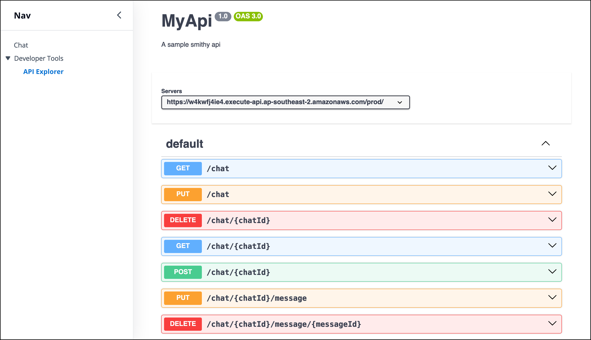
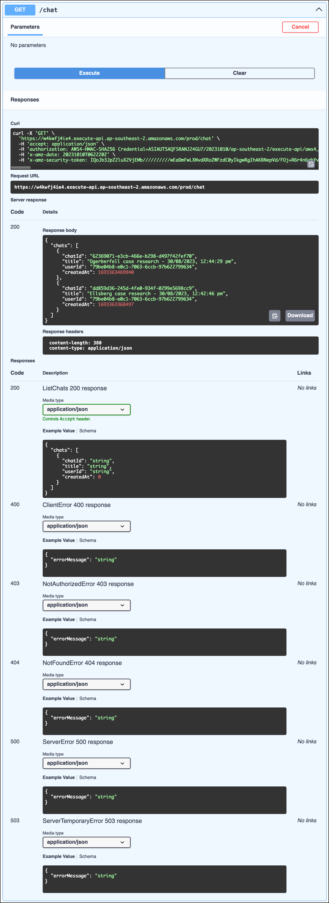

# API Overview

Galileo was designed 'API-first', with using Smithy and [Type Safe API](https://github.com/aws/aws-pdk/tree/mainline/packages/type-safe-api) to provide schema driven definitionsl. As the structure and implementation of these APIs are still subject to rapid change, their source code and associated README.md currently provide the source of truth for design and implementation of them. The web interface of Galileo provides an API explorer in the navigation side panel. This developer convenience feature enumerates all API endpoints implemented by Galileo, as we as functionality to let you interact with them. The screenhots below show this interface:

