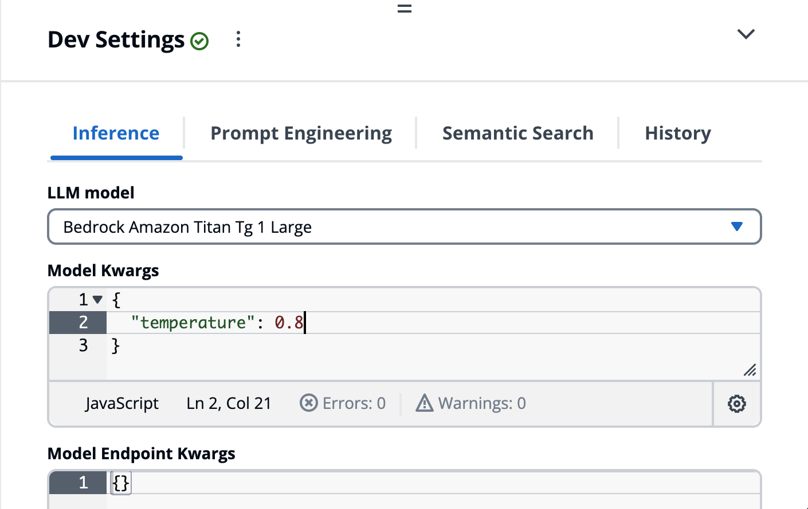
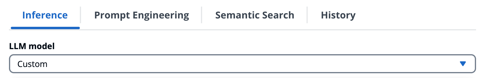
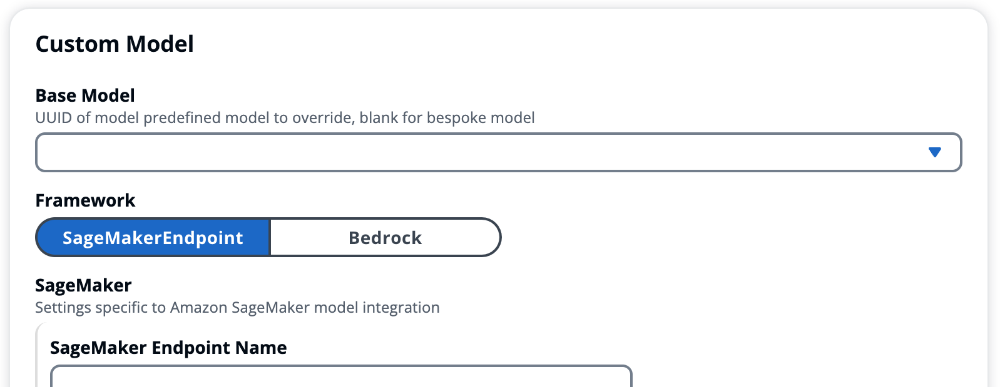
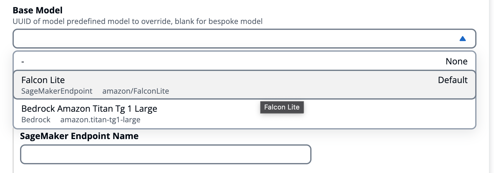
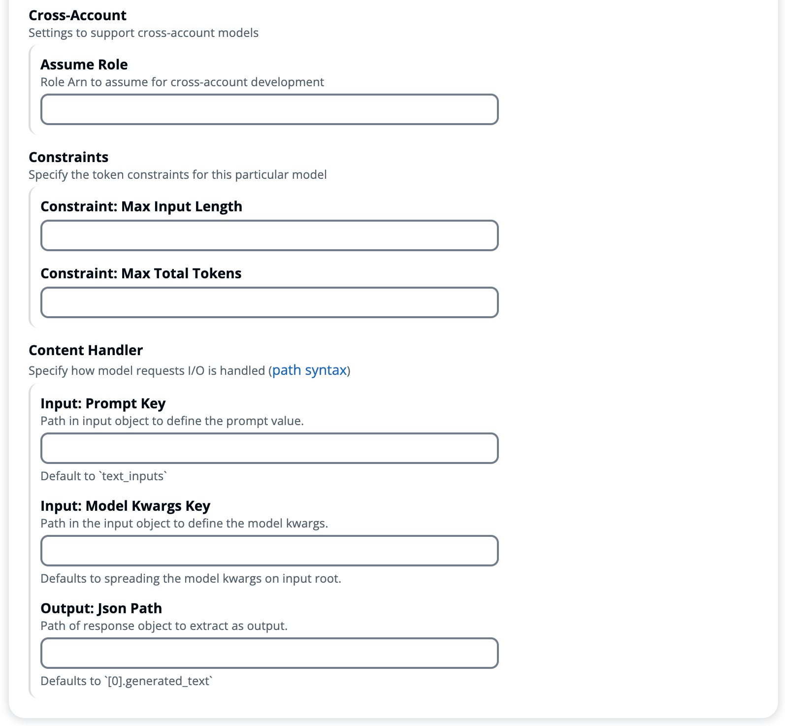
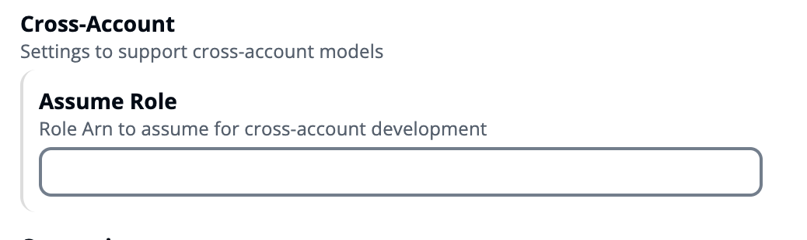
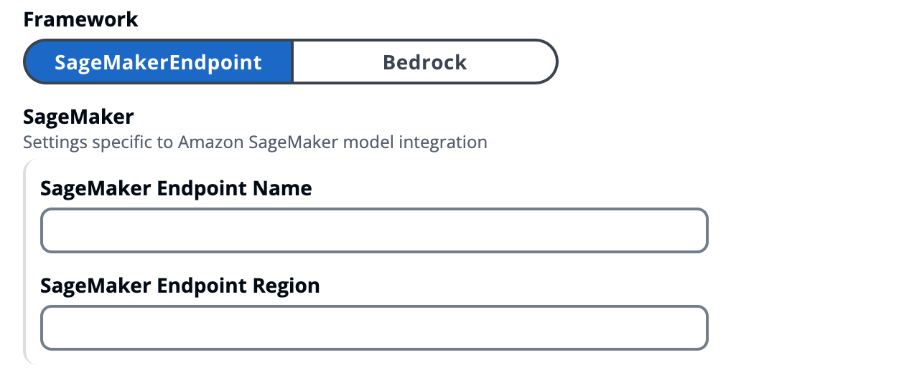
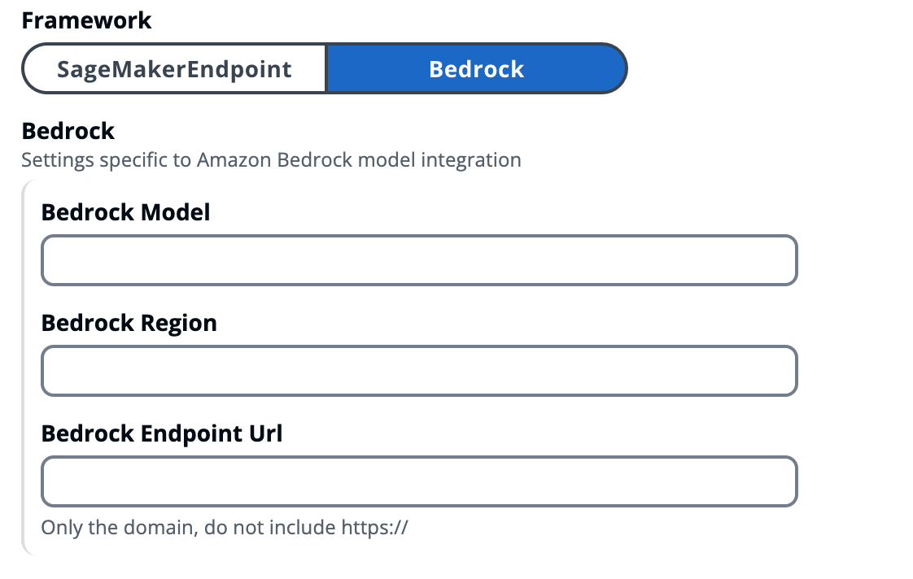

# Inference (Dev Settings)

--8<-- "disclaimer/third-party-model.md"
--8<-- "development/chat-dev-settings/_/header.md"

The inference settings are used to control the model that is used for inference. It supports choosing either one of the models deployed/configured with the solution, or integrating with a custom model external to the solution.

This enables testing different configurations, such as **Model Kwargs** and **Endpoint Kwargs** without requiring a deployment. And in the case of custom models, you can test a model deployed outside of the solution (e.g. SageMaker JumpStart), or modify the additional configuration of one of the deployed frameworks.



## Custom Model Integration

Most approaches to model integration define backend adapters for each type of model (*Falcon*, *Llama2*, etc) which requires writing and deploying code before testing a new model within the full application. Our goals is to support trying out any model without out requiring any code and/or deployment, which drove us to implementing a *dynamic adapter system* that is model agnostic and completely serializable. This enables developers to define model adapters at runtime from the UI via the **Dev Settings**.

Choose ==**Custom**== from the **LLM model** dropdown to integrate with a model deployed outside of the application.


That will expand a set of fields that allow you to integrate with any model deployed on the supported models.


You can either overwrite the configuration of a predefined model that is deployed, or start from scratch (==None==).

- When you select a predefined model from the **Base Model** list, it will populate the fields with the values of that model



### Common Settings

The following fields are common settings across the integration abstractions


#### Cross-Account Model Integration

By providing a *cross-account* IAM role to assume, when the inference engine invokes the framework via AWS SDK, it will first assume the role provided and use those temporary credentials to invoke the service endpoint. The role must have a trust policy attached that grants the application environment account permissions to assume the roles (`sts:AssumeRole`).

{ width="400" }

!!! danger "Cross-Account Security Considerations"
    By default the application in configured to only support assuming cross-account roles in the **Dev Stage** environment, and only **Administrators** are allowed to pass runtime config overrides to specify cross-account roles to assume. Ensure that only **trusted individuals** are granted **Administrator** access, and if enabling this functionality outside of **Dev Stage** environment that precautions and diligence are taken securing access of data and systems.

??? example "Trust Policy Example"

    ```javascript
    {
        "Version": "2012-10-17",
        "Statement": [
            {
                "Effect": "Allow",
                "Principal": {
                    "AWS": [
                        // the account that is allowed to assume this role
                        "arn:aws:iam::${TrustedAccountId}:root"
                    ]
                },
                "Action": "sts:AssumeRole",
                "Condition": {}
            }
        ]
    }
    ```

??? example "SageMaker Cross-Account Role Policy Example"
    [Resource types defined by Amazon SageMaker](https://docs.aws.amazon.com/service-authorization/latest/reference/list_amazonsagemaker.html#amazonsagemaker-resources-for-iam-policies){:target="_blank"}

    ```javascript
    {
        "Version": "2012-10-17",
        "Statement": [
            {
                "Sid": "InvokeSagemaker",
                "Effect": "Allow",
                "Action": [
                    // InvokeEndpoint + InvokeEndpointAsync
                    "sagemaker:InvokeEndpoint*"
                ],
                "Resource": [
                    // any model endpoint
                    "arn:aws:sagemaker:${Region}:${Account}:endpoint/*",
                    // specific model endpoint
                    "arn:aws:sagemaker:${Region}:${Account}:endpoint/${EndpointName}",
                ]
            }
        ]
    }
    ```

??? example "Bedrock Cross-Account Role Policy Example"
    [Resource types defined by Amazon Bedrock](https://docs.aws.amazon.com/service-authorization/latest/reference/list_amazonbedrock.html#amazonbedrock-resources-for-iam-policies){:target="_blank"}

    ```javascript
    {
        "Version": "2012-10-17",
        "Statement": [
            {
                "Action": "bedrock:Invoke*",
                "Resource": [
                  // any foundation model
                  "arn:aws:bedrock:${Region}::foundation-model/*",
                  // specific foundation model
                  "arn:aws:bedrock:${Region}::foundation-model/${ModelId}",
                  // custom model
                  "arn:aws:bedrock:${Region}:${Account}:custom-model/${ResourceId}"
                ],
                "Effect": "Allow"
            }
        ]
    }
    ```

### Service Specific Model Settings

The following are fields specific to each model hosting service

#### SageMaker Endpoint



#### Bedrock


