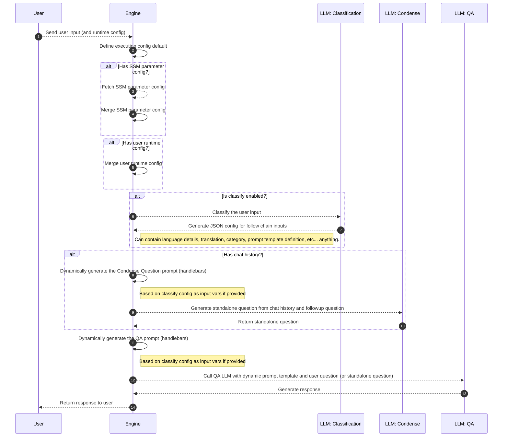

# Chat (Inference Engine)

## Chat Planner

```mermaid
sequenceDiagram
  autonumber
  participant U as User
  participant E as Engine
  participant LLM1 as LLM: Classification
  participant LLM2 as LLM: Condense
  participant LLM3 as LLM: QA

  U-->>E: Send user input (and runtime config)

  E->>E: Define execution config default

  alt Has SSM parameter config?
    E-->>E: Fetch SSM parameter config
    E->>E: Merge SSM parameter config
  end

  alt Has user runtime config?
    E->>E: Merge user runtime config
  end

  alt Is classify enabled?
    E-->>LLM1: Classify the user input
    LLM1-->>E: Generate JSON config for follow chain inputs
    Note left of LLM1: Can contain language details, translation, category, prompt template definition, etc... anything.
  end

  alt Has chat history?
    E->>E: Dynamically generate the Condense Question prompt (handlebars)
    Note right of E: Based on classify config as input vars if provided
    E-->>LLM2: Generate standalone question from chat history and followup question
    LLM2-->>E: Return standalone question
  end

  E->>E: Dynamically generate the QA prompt (handlebars)
  Note right of E: Based on classify config as input vars if provided

  E-->>LLM3: Call QA LLM with dynamic prompt template and user question (or standalone question)
  LLM3-->>E: Generate response
  E-->>U: Return response to user
```
