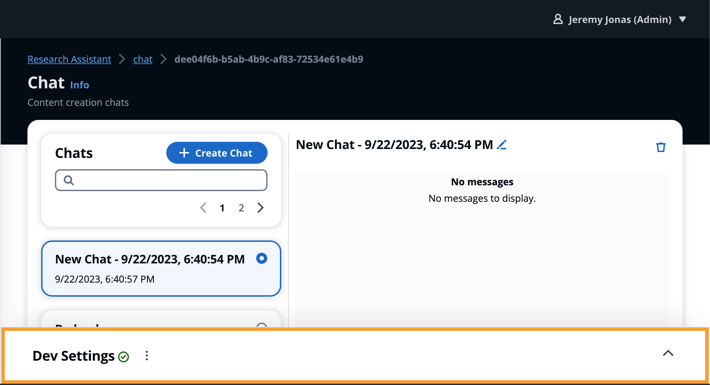
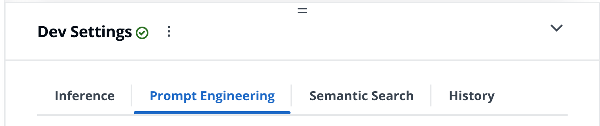
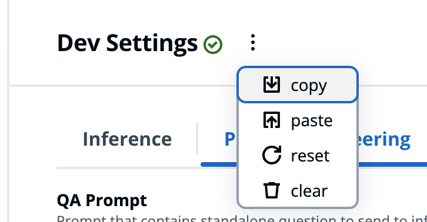

# Prompt Development Settings

--8<-- "disclaimer/third-party-model.md"
--8<-- "disclaimer/prompt-engineering-template.md"
--8<-- "development/dev-settings/_/header.md"
--8<-- "news-feed.md"

The **Dev Settings** is designed to support rapid development iterations without requiring a deployment, including integrating with models deployed outside the application. The aim is to support trying out the latest models against the full application flow before committing to codifying and deploying the models from within the application, such as testing a new model deployed from [SageMaker JumpStart](https://docs.aws.amazon.com/sagemaker/latest/dg/jumpstart-foundation-models.html){:target="_blank"}.

Cognito uses added to the **Administrators** group will see the **Dev Settings** panel rendered on the bottom of the *Chat* page.

Expanding the panel will expose the following set of tools

- **[Inference](./inference/index.md)**
    - Choose which deployed model to use
    - Integrate with model deployed outside of the application
    - Modify Kwargs

- **[Prompt Engineering](./prompting/index.md)**
    - Modify the prompts sent to the model
    - Rich editor with handlbars and preview

- Semantic Search
    - Modify search kwargs (number of results, filtering, etc.)

- History
    - Modify history options such as number of chat history results

## Actions Menu ==:material-dots-vertical:==

Clicking on the ==:material-dots-vertical:== icon will expose the following list of actions.

!!! warning "Persistence"
    Configurations are persisted anytime the chat session is changed or dev settings panel is closed.
    This enables the **Reset :material-reload:** action to reset from previously persisted config rather than default.

{ align="right" width="300"}

- **Copy :octicons-download-16:**: Copies the current config JSON to clipboard
- **Paste :octicons-upload-16:**: Overwrite current config with JSON from clipboard
- **Reset :material-reload:**: Reset the config to default state

!!! tip "Sharing Configs"

    To share configurations with other members of your team, or yourself, use the **Copy :octicons-download-16:**
    action to copy the current JSON configuration to the clipboard and send to otherwise.

    If running a workshop, you can also create a shared document with a list of configurations copied from the dev settings.
    Enabling other users to quickly copy and paste the same configuration with ease.
