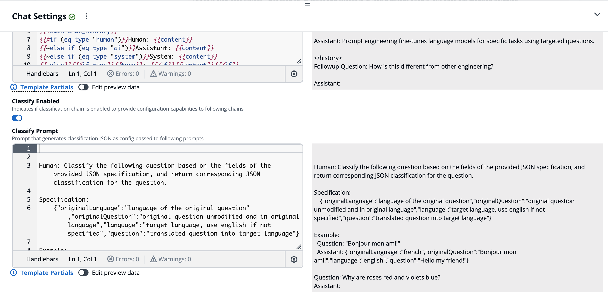

# Classify Prompt

Extend the capabilities of the conversational chain with the classification step. This step takes the users question and runs a pre-processing LLM inference step to classify the question into JSON data, which is provided to downstream steps in the chain.

- Detect question language
- Translate the question
- Categorize the question
- Sentiment analysis
- ... whatever your LLM can do

!!! tip "Multi-Language Support"

    If your knowledge base is all in english but you want to support end-users in different language, you can translate the input question to english and capture the original language, using the english translation throughout the chain, and tell the final QA LLM to reply in the original language. This has been tested with Bedrock Claude v2 with great success, you automatically support all languages that the model supports.

!!! warning "`question` property is special!!!"

    If the classification JSON response defines a `question` property it will override the original user question downstream.

## Classify JSON Output

The result from the classify step are parsed by JSON and the result object is passed to downstream chain steps (Condense/QA), which means they are provided to the chain step prompt template, which in our case supports handlebars.

The classification data can be used to control the downstream prompts, such as changing the prompt based on category, or instructing the LLM to reply in original language, or whatever.

## Enabling Classify

1. Open "Chat Settings" panel, and click "Prompt Engineering" tab
2. Scroll to bottom, and toggle "Classify Enabled"
3. Modify the classify prompt template to output the JSON data you want downstream
4. Update the other prompts to use this classification data to control the prompt template



## Examples

### Multi-Language Support, translation with reply in same language

=== "Classify Prompt"

    ```handlebars
    Human: Classify the following question based on the fields of the provided
    JSON specification, and return corresponding JSON classification for the question.

    Specification:
        {
          "originalLanguage":"language of the original question",
          "originalQuestion":"original question unmodified and in original language",
          "language":"target language, use english if not specified",
          "question":"translated question into target language"
        }

    Example:
      Question: "Bonjour mon ami!"
      Assistant: {"originalLanguage":"french","originalQuestion":"Bonjour mon ami!","language":"english","question":"Hello my friend!"}

    Question: {{question}}
    Assistant:
    ```

=== "QA Prompt"

    ```handlebars
    Human: Read the follow text inside <text></text> XML tags, and then answer the question based on the provided rules

    <text>
    {{context}}
    </text>

    Based on the text above, reply in {{originalLanguage}} to the following question.

    Question: {{question}}

    Assistant:
    ```

### Prompt Template Selector, based on category

=== "Classify Prompt"

    ```handlebars
    Human: Classify the following question based on the fields of the provided
    JSON specification, and return corresponding JSON classification for the question.

    Specification:
        {
          "category":"the category the question best matches"
        }

    Categories: Business, Personal, Other

    Example:
      Question: "Bonjour mon ami!"
      Assistant: {"category":"Personal"}

    Question: {{question}}
    Assistant:
    ```

=== "QA Prompt"

    ```handlebars
    Human: Read the follow text inside <text></text> XML tags, and then answer the question based on the provided rules

    <text>
    {{context}}
    </text>

    {{#if (eq category "Business")}}
    - use a formal tone
    - answer questions directly and provide references
    {{#else if (eq category "Personal")}}
    - use a friendly tone
    - be very conversational
    {{/if}}

    Based on the text above, answer the following question.

    Question: {{question}}

    Assistant:
    ```
