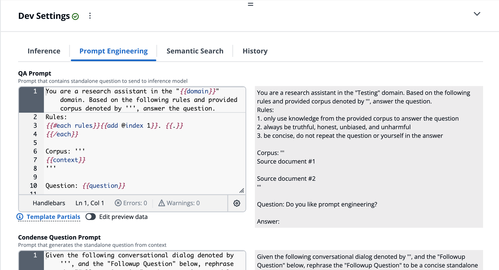
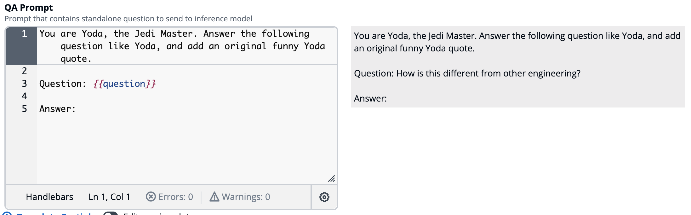
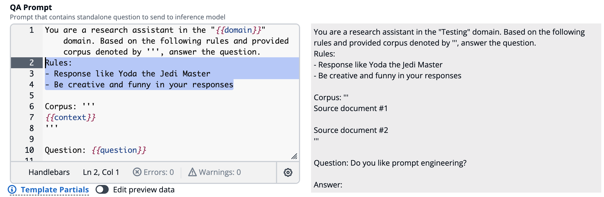
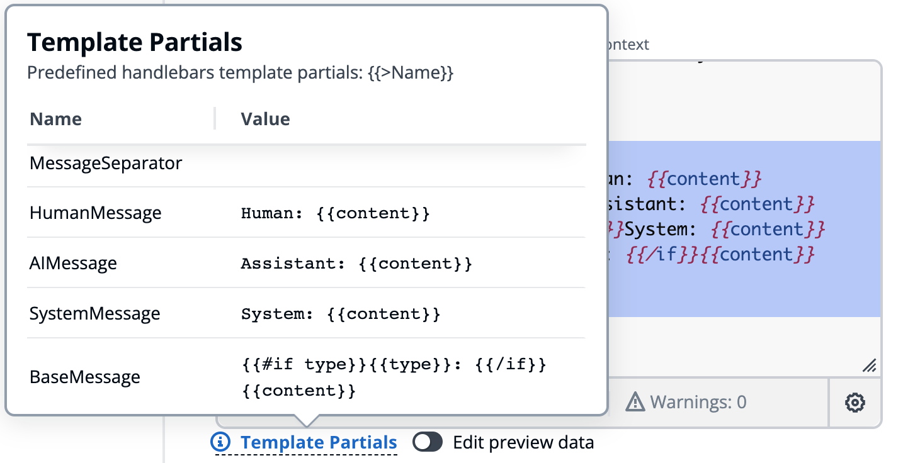
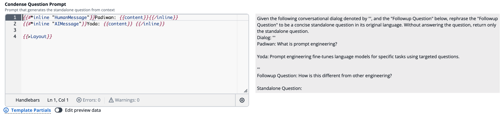

# Prompt Engineering (Dev Settings)

--8<-- "disclaimer/prompt-engineering-template.md"
--8<-- "development/dev-settings/_/header.md"

Prompt engineering is crucial in programming for generative AI applications. Sometime a simple tweaking of verbiage or order of statements makes all the difference, while other times the model might require a very bespoke format. To support rapid iterations and rich editing capabilities when developing prompts for different models, the prompt templates for the solution are implemented with [Handlebars](https://handlebarsjs.com/guide/expressions.html#basic-usage){:target="_blank"}. This enable more granular control over rendering of data, such as chat history messages, which may require very specific markup based on the target LLM, along with extensibility and composability of template fragments (or partials). The solution is designed to provide the greatest flexibility without trading off reusability.

In addition to the [built-in helpers](https://handlebarsjs.com/guide/builtin-helpers.html){:target="_blank"} provided by handlebars, the template system also supports [Strings](https://assemble.io/helpers/helpers-strings.html){:target="_blank"} and [Math](https://assemble.io/helpers/helpers-math.html){:target="_blank"} helpers.

Each template has predefined [template partials](https://handlebarsjs.com/guide/partials.html){:target="_blank"} for composing more reusable templates. The partials are primarily used for minimizing requirements for codifying reusable model adapter, however they can still be used through the **Dev Settings** as well.

## Prompt Templates
The solution is a modified version of [LangChain Conversational Retrieval QA chain](https://js.langchain.com/docs/modules/chains/popular/chat_vector_db){:target="blank"}, which chains together two prompt templates.

1. **Question Generator** *(Condense Question)*

    Generates a *standalone* question based on the *chat history* and a *followup question*. The *standalone* question that it generates is then used to query the database (retrieval) for similar documents that make up the **corpus** (*context*) of knowledge. This process condenses the *chat history* into a single *standalone* question that both reduces the length of *QA* prompt input and also support contextual *followup questions*.

    As an example, if the chat history asked *"Please summarize the TWA Flight 800 crash case"*, with a followup question of *"Why was ^^this^^ case significant?"*, the *standalone* question would be something like *"Why was ^^the TWA Flight 800 crash case^^ significant?"*. The replacement of ^^this^^ in the *followup question* is inferred from the *chat history* and makes the *followup* question able to be asked in isolation without the *chat history*.

    | Variable | Type | Description                                                              |
    | -------- | ---- | ------------------------------------------------------------------------ |
    | `question`* | *string* | The raw *followup* question from user |
    | `chat_history`* | *BaseMessage[]* | Array of [BaseMessages](https://js.langchain.com/docs/api/schema/classes/BaseMessage){:target="_blank"} with `type` getter added. |

2. **Question Answer** *(QA)*

    Prompts the LLM to answer a *standalone* question based on provided **corpus** (*context*). The response from this prompt is what is returned to the user and constitutes the *answer* from the model.

    | Variable | Type | Description                                                              |
    | -------- | ---- | ------------------------------------------------------------------------ |
    | `question`* | *string* | The *standalone* question generated above |
    | `context`* | *string* | The **corpus** of knowledge in a concatenated string |
    | `rules` | *string[]* | Array of string to further control the model handling |

    !!! tip "Chat History"

        Notice that `chat_history` is not provided to the *QA* prompt. This is because the *Condense Question* prompt has included the relevant chat history into a condensed *standalone* prompt that is independent of the chat history. This reduces the size of this prompt while also reducing the load on the model.


## Editor
After opening the **Dev Settings** panel on the bottom, click the ***Prompt Engineering*** tab.



The prompt template that you see in the editors is a ***flattened*** version of the corresponding template for the specific prompt. By default, all prompt template definitions are actually just `{{>Layout}}`, which is just the **Layout** partial, which is also just partials `{{>Header}}{{>Body}}{{>Footer}}`, and so on for compatibility.
> Flattening of templates is process of replacing all partials with their raw values.

!!! example "You can completely modify the template values to whatever you like"

        

!!! example "Or just parts of it, such are replacing the rules"

        

### How to replace chat message format?
The `chat_history` data is an array of [LangChain BaseMessages](https://js.langchain.com/docs/api/schema/classes/BaseMessage){:target="_blank"}, with [type](https://js.langchain.com/docs/api/schema/types/MessageType){:target="_blank"} property getter added for convenience.

The `{{>Dialog}}` partial will render each message based on the message type.
```handlebars
{{#each chat_history}}
{{~#if (eq type "human")}}{{>HumanMessage}}
{{~else if (eq type "ai")}}{{>AIMessage}}
{{~else if (eq type "system")}}{{>SystemMessage}}
{{~else}}{{>BaseMessage}}
{{/if}}

{{/each}}
```
The flattened version of the `{{>Dialog}}` partial looks like this.
```handlebars
{{#each chat_history}}
{{~#if (eq type "human")}}Human: {{content}}
{{~else if (eq type "ai")}}Assistant: {{content}}
{{~else if (eq type "system")}}System: {{content}}
{{~else}}{{#if type}}{{type}}: {{/if}}{{content}}
{{/if}}

{{/each}}
```
{:width="600"}

### Partial Replacement

To support extensibility and composability, especially when codifying model adapters, partials can be overwritten either inline within the template or by the template definition in the code. In the **Dev Settings** only the *inline partial* replacement is supported and uses [Handlebars Inline Partials](https://handlebarsjs.com/guide/partials.html#inline-partials) feature. Any predefined *template partial* can be replaced using this feature, along with ability to define new partials.

!!! example "Overwrite messages using inline partials"

        Example of overwriting just the `HumanMessage` and `AIMessage` partials.

        ```handlebars
        {{#*inline "HumanMessage"}}Padiwan: {{content}}{{/inline}}
        {{#*inline "AIMessage"}}Yoda: {{content}} {{/inline}}

        {{>Layout}}
        ```

        

!!! tip "Model Adapters"

    When it comes time to codify your prompt templates into model adapters, it is recommended to overwrite existing partials in adapter config, and/or use inline partials in based template. Doing the will enable your model adapter to receive updates for the rest of the template definitions not intended to be customized for the model. As example, if you only need to modify how the messages for chat history are rendered, if you only overwrite the `HumanMessage` and `AIMessage` partials, when the other partials (`Instruction`, `Messages`, etc) are modified the new values will be rendered for the model adapter as well. In comparison, if you simply overwrite the root template it will be completely decoupled and not receive updates.
