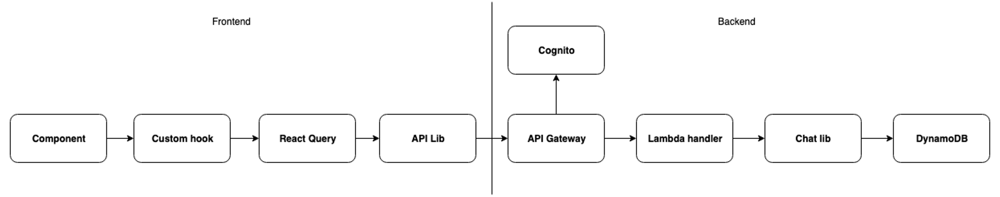

# Overview

To provide support for persistent multi-user session management, Galileio utilises DynamoDB, a highly scalable, serverless No-SQL datastore and the focus for this document. Below is high level overview of the schema used for the various CrUD operations supported by the UI.

## Data flow

The flow of data for the chat application follows a request-response model for all operations.
The general flow for both queries and mutations is as follows:

# UI State Management

UI actions are how we want our users to interact with the application. We first build out a UI mock to detail how we want our user stories to work, we could then determine what data needed to be available for each page or component and build out our access patterns. 

The UI Actions and corresponding access patterns are:

| UI Action                               | Data Available                | Action API                                      |
| --------------------------------------- | ----------------------------- | ----------------------------------------------- |
| User loads list of all chat sessions    | User Id                       | List all chats                                  |
| User creates new chat session           | User Id                       | Create chat                                     |
| User modifies existing chat session     | User Id, Chat Id, chat title  | Update chat                                     |
| User deletes chat session               | User Id, Chat Id              | Delete chat and associated messages and sources |
| User loads chat session                 | User Id, Chat Id              | List messages associated with chat session      |
| User posts new prompt in chat session   | User Id, Chat Id, Message     | Create chat message and associated sources      |
| User loads chat session message sources | User Id, Chat Id, Message Id  | List associated message sources                 |
| User deletes message in chat session    | User Id, Chat Id, Message Id  | Delete message and associated sources           |

## Schema

After a few attempts and trials and error, we were able to build out a key schema that satisfied all the requirements:

| Entity  | PK                  | SK                  | GSI1PK                 | GSI1SK                 |
| ------- | ------------------- | ------------------- | ---------------------- | ---------------------- |
| Chat    | {userId}            | CHAT#{chatId}       | {userId}#CHAT          | {timestamp}            |
| Message | {userId}            | MESSAGE#{messageId} | {userId}#CHAT#{chatId} | {timestamp}            |
| Source  | {userId}            | SOURCE#{sourceKey}  | N/A                    | N/A                    |
