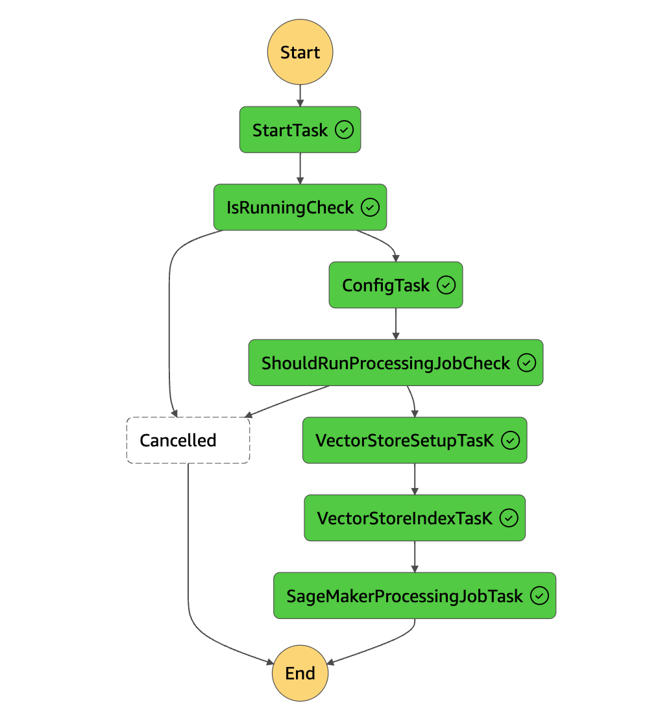

# Vector Storage

--8<-- "aws-genai-llm-chatbot/mention.md"

Currently, Galileo offers a single implementation for the storage of RAG vector embeddings: Aurora PostgreSQL Serverless with pgvector.

!!! note "Postgres Table Naming"
    To support multiple embedding models and vector sizes, the current implementation creates a database table name based on normalized model id and vector size. If you change the embedding model, or vector size, it will create a new database table. Currently there is no support for choosing which database table to use at runtime, you must deploy the updates and re-index the data into the new table. We are working on a more scalable solution for this.

## Getting data into the vector store

There is an indexing pipeline included in the Corpus stack which is a AWS Step Function state machine that is capable of processing a large amount of files in parallel (40k+ files). The pipeline support incremental and bulk updates, and is configured to index all files in the "processed bucket" included in the corpus stack.

{ width=400px align=right}
The "processed bucket" is the destination for objects that have already been processed, and expected to contain only raw text files with metadata defined on the objects. For data transformation, it is expected to have custom ETL processes for the data which will end up in this bucket.

!!! tip "Example Only"
    This is very much an example architecture for data ingestion at scale, and is expected to be replaced or modified to support your specific use case. Rather than attempting to force your implementation into the current process, it is recommended to replace this based on your needs. As we learn more about the patterns customers are using, we will work on extending this to support more real world use cases.

!!! warning "Manual Process"
    Currently the state machine must be manually triggered. It also supports scheduling which is disabled by default, which can be configured in the corpus stack ('demo/infra/src/application/corpus/index.ts') properties.

## Sample Dataset

The current sample dataset (US Supreme Court Cases), is defined as a stack which uses the CDK S3 Deployment construct to batch deploy data into the "processed bucket" with respective metadata. Additionally the sample data set stack will automatically trigger the state machine for indexing.

!!! warning "Being Deprecated"
    We are working on completely refactoring the way we handle sample data, and enable easy testing of other local data via the cli. Expect this to change very soon.

## FAQs

### How to load sample data for a demo?

If you deploy via the cli, you can choose to load the supplied sample dataset. To load your own data, run `pnpm galileo-cli document upload --help` to use the provided helper.

You can also manually add files to the S3 bucket provided with metadata, and then run the corpus state machine to perform indexing.

### Embeddings

Currently only a single embedding model can be configured at a time, however we are in the process of supporting multiple embedding models. Embedding is handled by a SageMaker Endpoint that supports multiple models with custom script, and via configuration you can deploy multiple models for direct testing, and the application will use the default (or first) model defined for runtime.

> Supports all [AutoModels](https://huggingface.co/transformers/v3.0.2/model_doc/auto.html) from transformers package.

- `packages/galileo-cdk/src/ai/llms/models/managed-embeddings`
- `packages/galileo-cdk/src/ai/llms/models/managed-embeddings/custom.asset/code/inference.py`
- `demo/infra/src/application/corpus`

#### How to change embedding model?

Using the cli (or `config.json`) you can enter any [AutoModels](https://huggingface.co/transformers/v3.0.2/model_doc/auto.html) supported model, and respective vector size. The `config.json` support multiple embedding models, however at this time only the default (or first) model will be used during runtime, while other models will get loaded into the SageMaker endpoint for direct testing against the endpoint.

#### How to change document chunking?

Chunk size and overlap are not configurable via cli or config at this time, you will need to edit the source code.

- `demo/corpus/logic/src/env.ts` contains the default env vars
- `demo/infra/src/application/corpus/index.ts` contains env var overrides for the state machine

```ts
CHUNK_SIZE: "1000",
CHUNK_OVERLAP: "200",
```

#### How to filter data and improve search results?

Currently the backend support filtering, however the UI does not have controls for filtering yet. You will need to customize the UI and chat message api calls to support filtering at this time.

### Pipeline StateMachine

See `demo/infra/src/application/corpus/pipeline/types.ts` for all configuration options.

#### How to start indexing objects in S3?

Just start execution of the Pipeline StateMachine from the StepFunction console with the default payload. It will auto-detect new/modified files and will index them, or if everything is new it will bulk index everything. If you change the embedding model and run execution, it will create a new database table and index for the new embeddings.

#### How do I force BULK re-indexing?

If you want to force re-indexing everything, use the following payload.

```json
{
  "IndexingStrategy": "BULK",
  "SubsequentExecutionDelay": 0,
  "ModifiedSince": 1
}
```

#### How to test indexing on a small sample set?

You can limit the number of files that are processed with the following payload.

```json
{
  "MaxInputFilesToProcess": 1000,
  "IndexingStrategy": "MODIFIED",
  "SubsequentExecutionDelay": 0,
  "TargetContainerFilesCount": 500,
  "ModifiedSince": 1
}
```

> Process the first 1000 file, across 2 containers

#### How do I override environment variables?

You can override environment variables from the payload as well (make sure all keys and values are `string`):

```json
{
  "IndexingStrategy": "BULK",
  "SubsequentExecutionDelay": 0,
  "ModifiedSince": 1,
  "Environment": { "CHUNK_SIZE": "2000", "CHUNK_OVERLAP": "400" }
}
```

> Bulk reindexing with custom chunksize

#### How to reset vector store data?

The state machine can be executed with the following payload to delete the database table data (TRUNCATE), reset the index, and force bulk re-indexing.

```json
{
  "VectorStoreManagement": {
    "PurgeData": true,
  }
}
```
