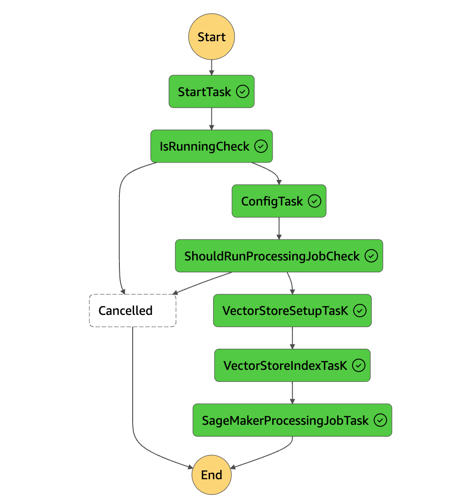

# Vector Storage

--8<-- "aws-genai-llm-chatbot/mention.md"

Currently, Galileo offers a single implementation for the storage of RAG vector embeddings: Aurora PostgreSQL Serverless with pgvector. In the future, additional vector storage components will be implemented.

!!! note "Postgres Table Naming"
    To support multiple embedding models and vector sizes, the current implementation creates a database table name based on normalized model id and vector size. If you change the embedding model, or vector size, it will create a new database table. Currently there is no support for choosing which database table to use at runtime, you must deploy the updates and re-index the data into the new table. We are working on a more scalable solution for this.

## Getting data into the vector store

There is an indexing pipeline included in the Corpus stack which is a AWS Step Function state machine that is capable of processing a large amount of files in parallel (40k+ files). The pipeline support incremental and bulk updates, and is configured to index all files in the "processed bucket" included in the corpus stack.

{ width=400px align=right}
The "processed bucket" is the destination for objects that have already been processed, and expected to contain only raw text files with metadata defined on the objects. For data transformation, it is expected to have custom ETL processes for the data which will end up in this bucket.

!!! tip "Example Only"
    This is very much an example architecture for data ingestion at scale, and is expected to be replaced or modified to support your specific use case. Rather than attempting to force your implementation into the current process, it is recommended to replace this based on your needs. As we learn more about the patterns customers are using, we will work on extending this to support more real world use cases.

!!! warning "Manual Process"
    Currently the state machine must be manually triggered. It also supports scheduling which is disabled by default, which can be configured in the [../../../../demo/infra/src/application/corpus/index.ts](corpus stack) properties.

## Sample Dataset

The current sample dataset (US Supreme Court Cases), is defined as a stack which uses the CDK S3 Deployment construct to batch deploy data into the "processed bucket" with respective metadata. Additionally the sample data set stack will automatically trigger the state machine for indexing.

!!! warning "Being Deprecated"
    We are working on completely refactoring the way we handle sample data, and enable easy testing of other local data via the cli. Expect this to change very soon.

## How to reset vector store data?

The state machine can be executed with the following payload to delete the database table data, reset the index, and force bulk re-indexing.

```json
{
  "VectorStoreManagement": {
    "PurgeData": true,
  }
}
```
