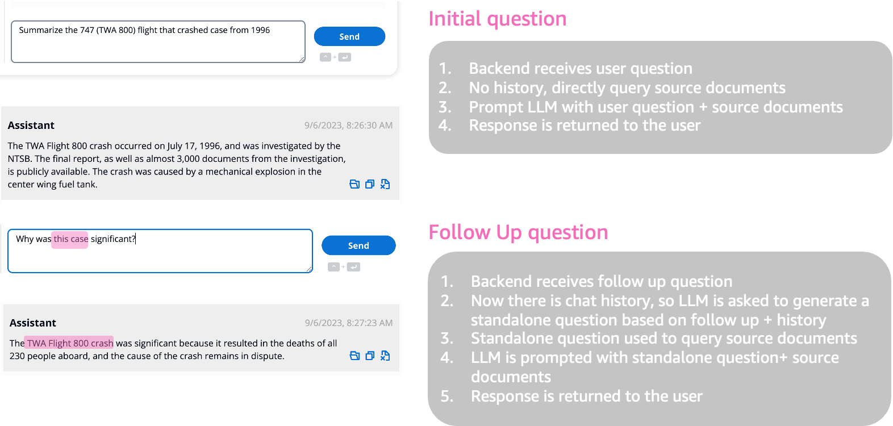
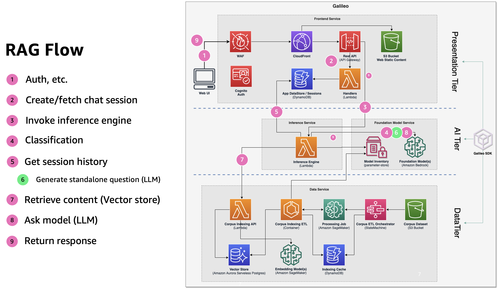
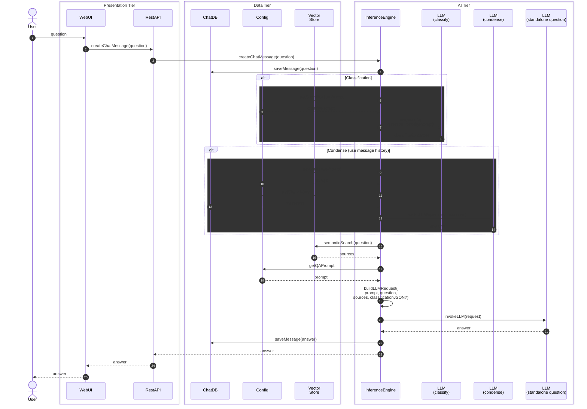

# How RAG (Retrieval Augmented Generation) Applications Work

This will not be new information if your are familiar with retrieval augmented generation (RAG) flows. The goal of Galileo is not to re-invent RAG applications, instead it focuses on repeatability, reusability, experimentation, and scalability.

There are three key components of RAG flows:

1. Chat History: the dialog between end-user and the AI
2. Corpus: the knowledge base the AI should use
3. Inference: the actual LLM performing the task

It is pretty straightforward, but when you consider statelessness of LLM, token limitation, quality and robustness of corpus dataset, size of corpus, developer experience of changing models, variations of prompt formatting between models, and much more, it quickly starts to become very complex.

## Chat Experience

The key to conversational chat is persistence of the *context* between dialogs, basically the ability to infer the meaning of a word like `this` based on chat history.

### Generic RAG flow

Here is what that looks like at a high-level in the backend:

### Chat data flow

Here is the detailed flow for a question-answer (once authenticated with the system):

