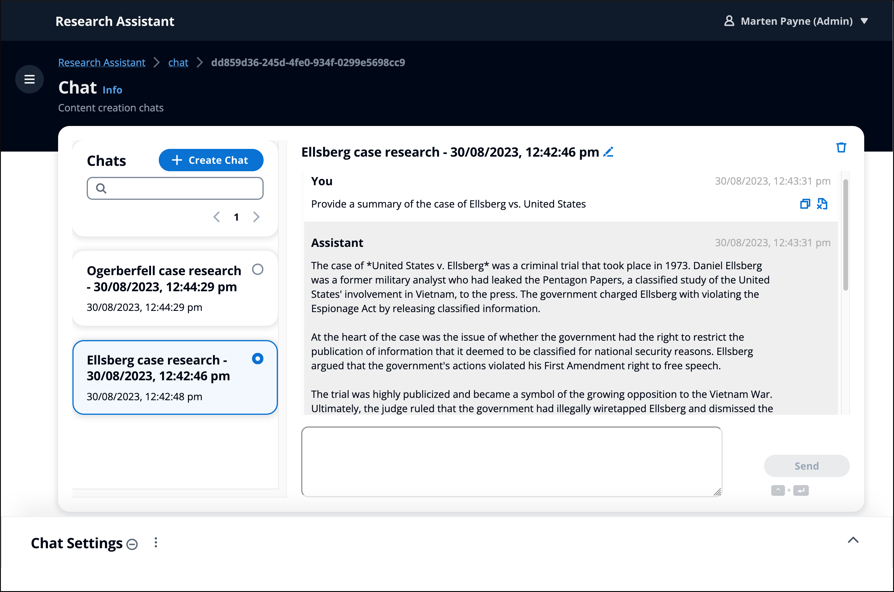
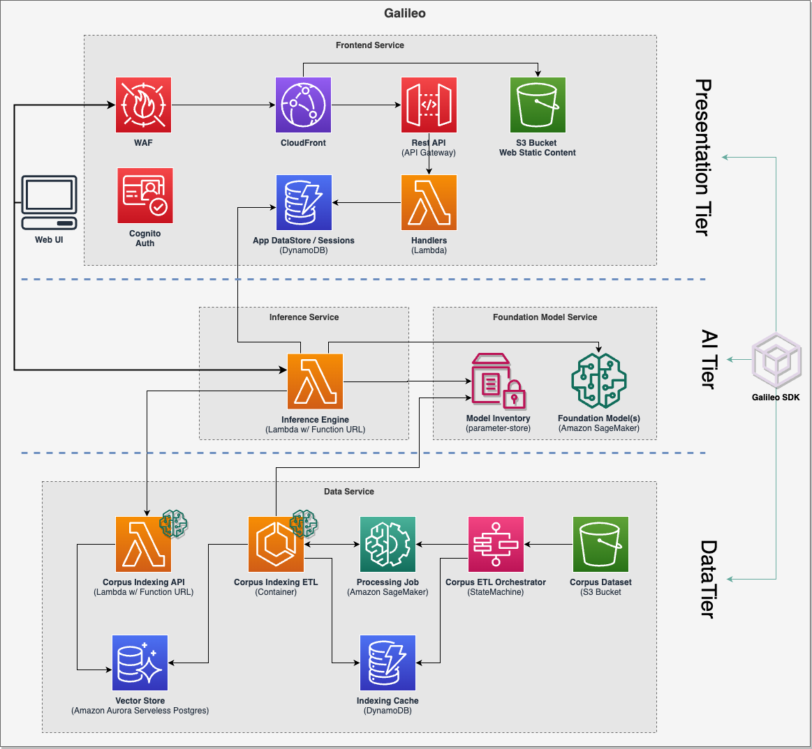
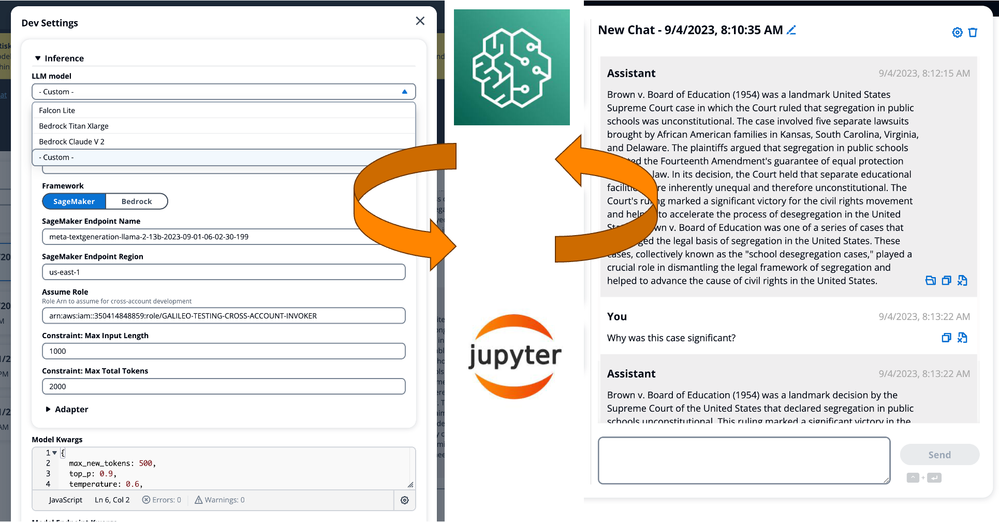

# Overview

--8<-- "wip.md"
--8<-- "aws-genai-llm-chatbot/mention.md"
--8<-- "disclaimer/third-party-model.md"
--8<-- "disclaimer/prompt-engineering-template.md"

## Introduction

Galileo is a reference implementation of a deployable 3-tier retrieval augmented generative (RAG) application that aims to meet the needs of developers as they seek to rapidly experiment with, deploy, and launch GenAI powered products and services that utilise RAG. It is implemented in a number of languages, using CDK to define the infrastructure it deploys. It can be optionally deployed with a sample dataset of US Supreme Court decision documents, providing content users can interact with immediately.

In the future, we aim to evolve Galileo into a framework of composable generative AI CDK components and project blueprints.

## User Experience

The screenshot below shows the default web interface, showing an active chat session, session management features (rename, delete, etc.), as well as the chat developer settings panel (collapsed).

## Architecture

This simplified architecture diagram shows the key service components utilised to implemented each of the three tiers described described in the [vision documentation](./vision).

## Tooling

**Meeting development teams where they are... between notebooks and application code.**

New groundbreaking LLMs are coming out monthly and even weekly, this momentum will only increase and no framework will be able to keep up with this fast pace. Which is why Galileo focuses on model agnostic integration and supporting developers to try out the latest LLMs against the full application with zero code.

