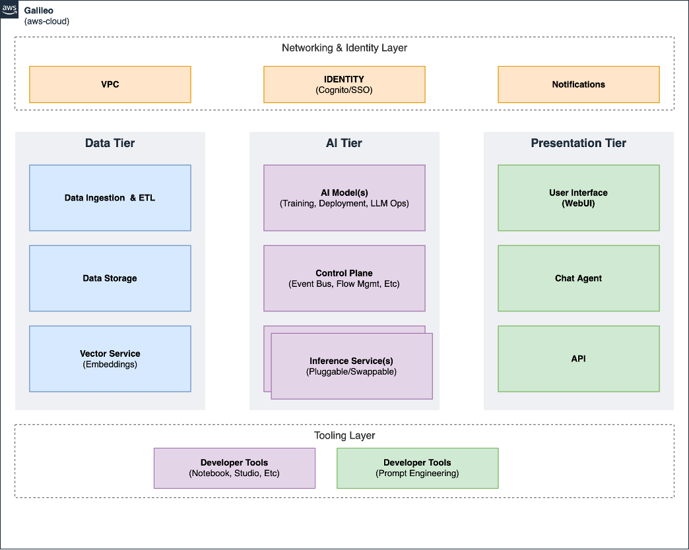

# Vision

This aims to serve as a common framework for multiple Generative AI/LLM use-cases, including but not limited to:

* Content Creation: Generative AI can generate human-like text, helping in areas like article writing, advertising, or social media content creation.
* Predictive Modelling: Using Generative AI to forecast future trends based on historical data.
* Translation and Transcription: Generative AI can be used for language translation or speech transcription, converting spoken words into written text.
* Recommendation Systems: Generative AI can provide personalized recommendations based on a user's past behaviour and preferences.
* Conversational AI: Chatbots and virtual assistants that understand and respond to natural language queries are a prominent use case of Generative AI.

With regards to following common concerns:

* Data Security and Privacy: Ensuring the protection of data and user privacy is paramount.
* Scalability: The system should scale as demand grows.
* Cost-effectiveness: Balancing system performance and cost can be a challenge.
* Model Training and Tuning: Achieving optimal model performance requires continuous tuning.
* Bias and Fairness: AI models should be free from bias and should deliver fair results.

## Mental Model

Taking the above into account, the mental model for this approach can be envisaged as a multi-tier architecture:

1. Data Tier: This tier is responsible for data ingestion, storage, and transformation (ETL), and provide API for querying data and performing operations against the data.
2. AI Tier: This tier involves the core machine learning model development, training, tuning, and deployment (ML Ops), and all inference.
3. Presentation Tier: This tier manages user interaction, result presentation, and integration with other systems. Users can input queries or requests and receive responses generated by the AI model. The presentation tier can consist of web interfaces, mobile apps, or any other user-facing interface. Client-side Chat Agent and similar prompt session management is core this to layer.
4. Networking & Identity Layer: Shared layer for networking and identity resources, such as VPC and Cognito.
5. Tooling Layer: This supporting tier has the supporting tooling necessary for developers to build Generative AI applications. The tooling tier consists of supporting interfaces for developers (Notebooks, IDE tools, etc) and specific interfaces for generative ai (Prompt engineering etc).

The high-level components shown below illustrates the adapted three tier architecture we used to form the mental model when designing the architecture for this framework.

## Data Tier

This tier is responsible for data ingestion, storage, and transformation (ETL), including the Vector Store for embeddings.

Data Processing and Transformation: Depending on the application, there might be additional components for data processing and transformation. For example, in natural language processing tasks, text preprocessing, entity extraction, or semantic analysis modules may be required to enhance the AI processing and improve the accuracy of the generated responses.

## AI Tier

This tier involves the core machine learning model development, training, tuning, and deployment stages, along with all inference related services, and a control plane to choreograph more complex use cases.

This tier is where the generative AI model resides. It performs the main processing and generates responses based on the user inputs received from the presentation tier. The AI model can be a large language model, a stable diffusion image generation model, or a deep learning model specifically designed for a particular task, such as image generation or music composition. The AI processing tier involves complex algorithms,machine learning models, and compute infrastructure to perform the AI processing efficiently.

Inference Engine: The inference engine is responsible for running the trained AI model to generate responses in real-time. It takes user inputs, processes them using the AI model, and produces the corresponding output. This component can be optimized for high-performance inference to handle concurrent user requests efficiently.

## Presentation Tier (Application)

The presentation tier remains similar to the traditional three-tier architecture. It handles the user interface and interaction with the system. Users can input queries or requests and receive responses generated by the AI model. The presentation tier can consist of web interfaces, mobile apps, or any other user-facing interface.

